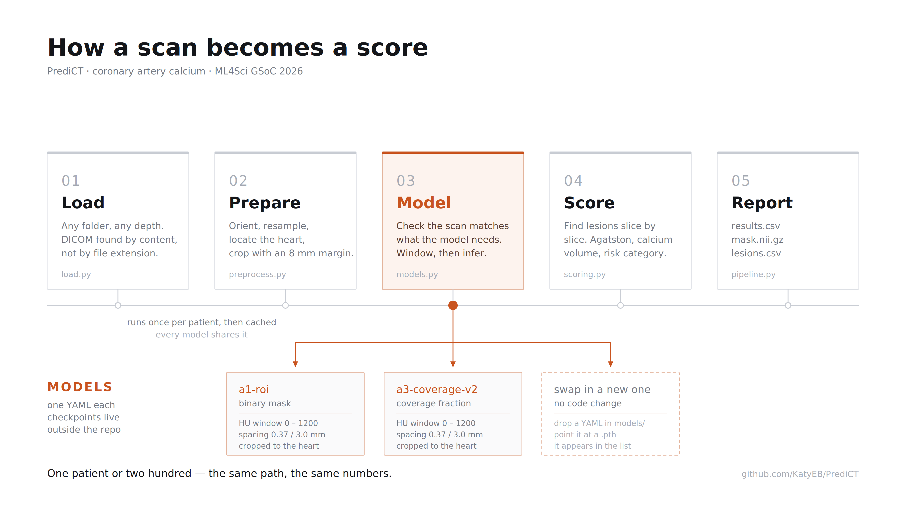
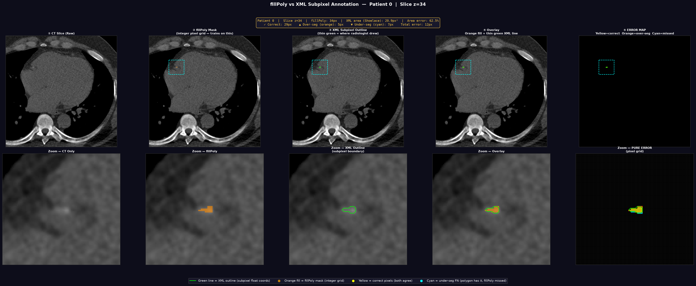
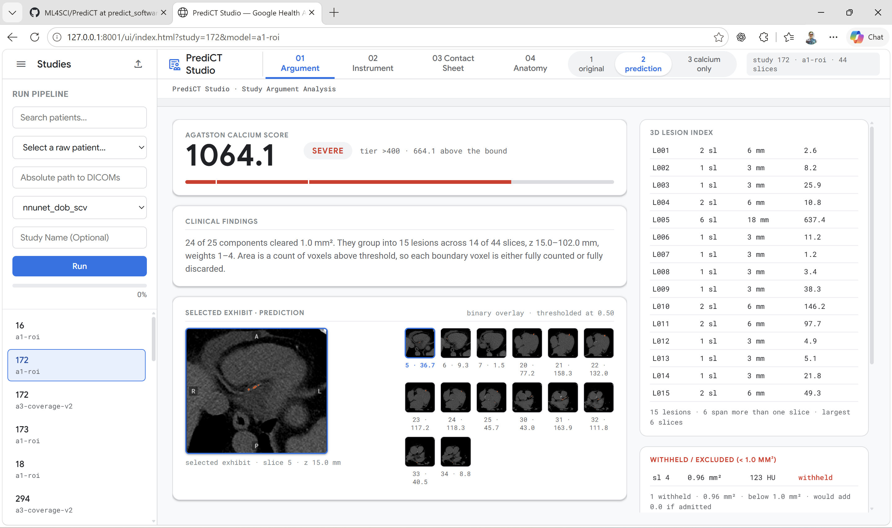
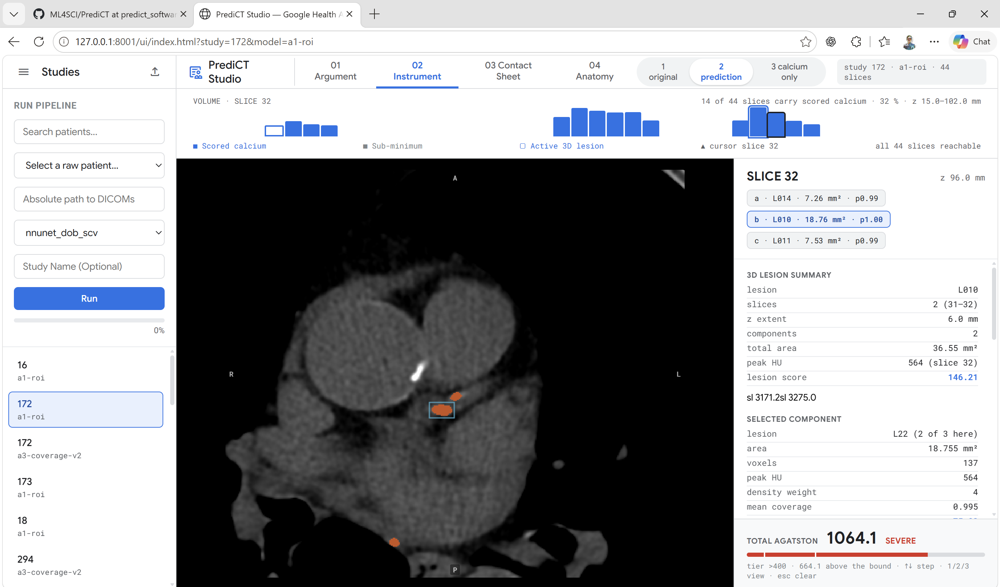
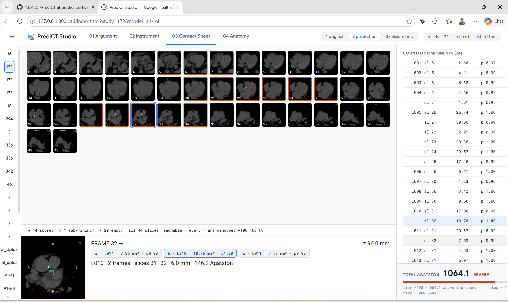
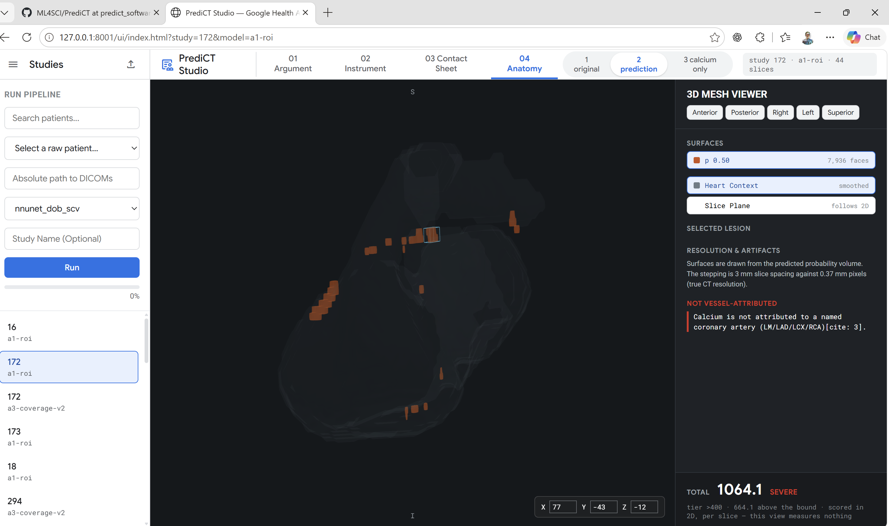

# PrediCT: Deep Learning Segmentation & Autonomous Clinical Workstation for Coronary Calcium Scoring
**Google Summer of Code 2026 @ ML4Sci**  
**Contributor:** Soham Jadhav | **Mentors:** Katy Butler, Anna | **Co-contributor:** Rajat  
**Repository Branches:**
* **Algorithmic Core:** [`ML4Sci/PrediCT: soham_segmentation`](https://github.com/ML4Sci/PrediCT/tree/soham_segmentation)
* **Clinical Software Workstation:** [`ML4Sci/PrediCT: predict_software`](https://github.com/ML4Sci/PrediCT/tree/predict_software)

<p align="center">
  
</p>

---
## Executive Summary

Coronary Artery Calcium (CAC) scoring on non-contrast cardiac CT scans is one of modern medicine’s most dependable tools for forecasting cardiovascular risk. In routine clinical practice, treatment decisions do not rely on standard computer vision metrics like pixel-level Dice overlap; they hinge directly on the patient's **Agatston score**.

Over the course of Google Summer of Code 2026 with ML4Sci, this project tackled two fundamental bottlenecks preventing automated CAC analysis from succeeding in clinical environments:

1. **The Algorithmic Flaw (Pillar I):** Standard binary segmentation rasterizes smooth radiologist polygons onto discrete pixel grids, introducing severe boundary quantization errors that systematically overcount small lesions and artificially inflate clinical risk categories. We designed and trained an analytic continuous soft-coverage framework (Approach 3) that cuts boundary error from **10.19% down to 0.03%**, reducing typical patient score error by **2.2×** and significantly improving clinical risk categorization ($p = 0.038$).
2. **The Clinical Deployment Gap (Pillar II):** Accurate neural networks routinely fail in healthcare because they operate as silent black boxes with hardcoded assumptions, unverified parameter drift, and zero slice-level auditability. We built **PrediCT Studio**, a production-grade, local-first clinical workstation featuring SHA256-locked contract gates, an interactive diagnostic viewer, an explicit audit ledger for filtered lesions, and interactive 3D mesh rendering.

Here is how both pillars were engineered from the ground up.

---

# Pillar I: Algorithmic Core (`soham_segmentation`)

### 1. The Clinical Objective: Patient Triage Over Pixel Dice

In medical imaging, reaching a 0.70 or 0.80 Dice score looks respectable on an academic leaderboard. But on tiny, sparse coronary plaques, standard Dice metrics hide critical failure modes. A two-voxel boundary error on a small lesion can double its measured area, inadvertently pushing a borderline patient across a clinical threshold from routine lifestyle advice into lifelong statin therapy.

Clinical risk is governed by Dr. Hahn's 6-tier Agatston risk classification:
* **0:** Zero / No detectable plaque
* **1 – 100:** Mild risk
* **101 – 300:** Moderate risk
* **301 – 400:** Moderately High risk
* **401 – 1000:** Severe risk
* **1000+:** Extensive risk

**The Core Research Question:** Can continuous soft coverage labels resolve boundary quantization errors in sparse CT scans and improve clinical Agatston risk classification compared to standard binary segmentation?

---

<p align="center">
  
  <br>
  <em>Figure 1: The five-stage PrediCT processing pipeline: raw DICOM discovery $\rightarrow$ orientation & cardiac cropping $\rightarrow$ contract-gated model inference $\rightarrow$ slice-by-slice Agatston lesion scoring $\rightarrow$ multi-format clinical reporting.</em>
</p>

---

### 2. The Data Bottlenecks: Extreme Sparsity & Integer Grid Snapping

Developing a reliable segmentation pipeline required overcoming two severe data-level challenges in the Stanford COCA dataset (447 clean, valid gated cardiac scans):

#### Extreme Class Imbalance (~1:27,000)
Coronary calcium occupies a minute fraction of the overall chest cavity:
* The median calcium burden per positive scan is just **357 voxels**.
* A standard resampled volume contains roughly **31 million voxels**.
* The voxel-level foreground-to-background ratio is approximately **1:27,000**.

Under standard uniform 3D patch sampling, nearly every cropped block lands on empty lung tissue or thoracic muscle. The network quickly learns that outputting an all-zero tensor yields a near-perfect binary cross-entropy loss, settling into a trivial local minimum with a persistent `Dice = 0.0`. 

To establish stable convergence, we used MONAI's `RandCropByPosNegLabeld(pos=1, neg=1)` to enforce an even balance between patches centered on calcified lesions and background cardiac tissue.

#### Boundary Quantization in Binary Masks (`fillPoly`)
Clinical ground-truth annotations in COCA are provided as floating-point subpixel polygon coordinates hand-drawn by expert radiologists. Standard medical imaging pipelines convert these vector loops into raster masks using OpenCV's `cv2.fillPoly`.

Because `fillPoly` rounds subpixel coordinates to the nearest discrete integer pixel grid, small calcifications suffer significant geometric distortion:

| Patient / Slice | Lesion Size | Rescaling Factor | `fillPoly` Area Error | Impact Severity |
| :--- | :--- | :--- | :--- | :--- |
| **Patient 10 (z=10)** | Tiny | 1.18× | **+79.4%** | Severe |
| **Patient 0** | 34 pixels | 1.28× | **+62.5%** | Severe |
| **Patient 1 (z=19)** | Moderate | 1.03× | **+7.0%** | Low |

Across the entire dataset, binary rasterization introduces an average area error of **10.19%**, with a persistent **+6.33% systematic overcounting bias**. This establishes an artificial ceiling on model accuracy: the network is penalized during training for attempting to predict true subpixel boundaries.

---

<p align="center">
  
  <br>
  <em>Figure 2: Subpixel rasterization artifacts: (1) Anatomical CT slice, (2) Integer <code>fillPoly</code> binary mask, (3) True XML subpixel polygon, (4) Composite overlay, (5) Error map highlighting boundary over-segmentation (orange) and under-segmentation (cyan).</em>
</p>

---

### 3. The Algorithmic Fix: Approach 3 (Continuous Coverage Fraction)

To resolve integer snapping, we designed **Approach 3 (Soft Coverage)**. Instead of rounding boundary voxels to a hard 0 or 1, we implemented the **Sutherland-Hodgman polygon clipping algorithm** to compute the exact analytic intersection between the radiologist's polygon and each voxel's bounding box:

$$\text{Voxel Value} = \frac{\text{Area}(\text{Polygon} \cap \text{Pixel Box})}{\text{Area}(\text{Pixel Box})}$$

Each boundary voxel receives a continuous ground-truth value between $0.0$ and $1.0$, accurately capturing partial volume effects. Comparing continuous mask sums against the XML Shoelace area formula showed that Approach 3 reduced mean area error from **10.19% down to 0.03%**—virtually eliminating boundary bias.

```
Subpixel XML Area vs. Mask Representation:
Patient 411 (Tiny):    6.47 px² XML  →   6.51 px² A3 Mask  (0.59% error)
Patient 316 (Small):   99.06 px² XML →  99.25 px² A3 Mask  (0.19% error)
Patient 354 (Large): 1228.16 px² XML → 1229.14 px² A3 Mask (0.08% error)
```

#### Pipeline Engineering Milestones
* **HU Window Normalization:** Standard soft-tissue (`[-150, 350]` HU) and bone presets (`[-100, 1000]` HU) clipped hyperdense calcium peaks, capping validation Dice at ~0.25. Expanding the normalization window to **`[0, 1200]` HU** captured the full dynamic range, lifting validation Dice to ~0.61.
* **Pericardial ROI Cropping:** Full-volume thoracic scans forced models to differentiate coronary plaques from dense ribs, spine, and sternal wires. Constraining inputs strictly to the heart using TotalSegmentator reduced volumetric Mean Absolute Error (MAE) from **249.46 mm³ down to 171.30 mm³**.
* **The 14 Corrupted Scans Sweep:** Systematic sweeps identified 14 patient scans suffering from multi-series DICOM/XML slice registration mismatches (which produced artificial overshoots of up to +723% mask area). Eliminating these 14 corrupted cases produced the clean 441-patient cohort (310 train / 65 val / 66 test) used to train `A3 Coverage v2`.

---

### 4. Quantitative Results & Clinical Validation

#### Volumetric Generalization (Held-out Test Cohort, $n=66$)

| Model | Checkpoint Epoch | Val Dice (Mean / Med) | Test Dice (Mean / Med) | Test Vol. MAE | Test Vol. Bias |
| :--- | :--- | :--- | :--- | :--- | :--- |
| **A1 Full-Volume** | 110 | 0.6097 / 0.6916 | 0.640 / 0.707 | 249.46 mm³ | −199.89 mm³ |
| **A1 ROI-Cropped** | 164 | 0.6524 / 0.7467 | 0.669 / 0.747 | 171.30 mm³ | −32.46 mm³ |
| **A3 Coverage v1** | 166 | 0.6156 / 0.6900 | 0.654 / 0.742 | 164.23 mm³ | **−0.09 mm³** |
| **A3 Coverage v2** | 140 | **0.7227 / 0.7865** | **0.655 / 0.767** | **174.50 mm³** | −56.28 mm³ |

*Note on Bias:* A3 v1’s near-zero bias (−0.09 mm³) was caused by error cancellation: over-predicting mild lesions while under-predicting severe lesions. Retraining on the sanitized cohort (`A3 Coverage v2`) eliminated artificial training overshoots, yielding a conservative, clinically sound model with a **median MAE of 58.32 mm³** and a **median Dice of 0.767**.

---

#### Clinical Agatston Scoring & Risk Stratification

We computed full Agatston scores (lesion area multiplied by peak attenuation density factor: $130\text{--}199\text{ HU}=1$, $200\text{--}299\text{ HU}=2$, $300\text{--}399\text{ HU}=3$, $\ge 400\text{ HU}=4$) and evaluated both models against XML ground truth using Dr. Hahn's 6-bin clinical risk scale:

| Metric | A1 ROI-Cropped (Binary) | A3 Coverage (Soft Labels) | Practical Meaning |
| :--- | :--- | :--- | :--- |
| **Median Absolute Error (AE)** | 42.97 | **19.27** | **2.2× lower error** for typical scans |
| **Mean Absolute Error (MAE)** | **179.62** | 188.53 | Heavily skewed by extreme scores (>2000) |
| **Pearson Correlation ($r$)** | **0.8510** | 0.8458 | High linear agreement with ground truth |
| **R² Score** | **0.724** | 0.715 | Consistent variance tracking |
| **Risk Concordance (Test, $n=66$)** | 77.3% (51/66) | **83.3% (55/66)** | Fewer over-stratification errors on borderline cases |
| **Risk Concordance (Replication, $n=374$)** | 70.7% | **76.7%** | **Statistically significant ($p = 0.038$)** |

Because Agatston scores span from single-digit specks to several thousand units, mean absolute error is easily skewed by a handful of high-density scans. Looking at **Median Absolute Error** gives a clearer view of typical patient performance, where Approach 3 delivers a **2.2× improvement** (19.27 vs. 42.97).

Under the 6-tier risk scale, Approach 3 achieved **83.3% agreement** compared to 77.3% for Approach 1 on the 66-patient test set (McNemar discordant pairs: $b=4, c=0, p=0.125$). When replicated on the paired 374-patient cohort, the categorical advantage held firmly at **76.7% vs. 70.7%**, reaching statistical significance (**McNemar exact $p = 0.038$**; 27 A3-only corrections vs. 13 A1-only corrections).

```
Patient 205 (True Agatston: 92.0 — Mild)
├── A1 Binary Prediction  : 529.1 → Severe (over-stratified by two clinical tiers)
└── A3 Coverage Prediction: 315.4 → Moderate (substantially closer to true risk)

Patient 82 (True Agatston: 369.1 — Moderately High)
├── A1 Binary Prediction  : 834.1 → Severe (misclassified into highest tier)
└── A3 Coverage Prediction: 251.2 → Moderate (avoids severe category escalation)

Patient 196 (True Agatston: 2822.9 — Extensive)
├── A1 Binary Prediction  : 2357.0 → Extensive (closer raw score)
└── A3 Coverage Prediction: 1570.3 → Extensive (correct clinical tier)
```

* **A3 protects borderline patients:** Binary integer snapping inflates small lesion boundaries, pushing borderline patients into higher risk categories. Continuous coverage fractions prevent these threshold jumps.
* **A1 tracks bulk volume on high scores:** For very large calcifications (>2000), A1 estimates raw magnitude closer to ground truth. However, because scores above 400 or 1,000 fall into high-risk intervention categories regardless, this difference carries less clinical consequence.

---

# Pillar II: Autonomous Clinical Workstation (`predict_software`)

Achieving strong statistical metrics on test sets is only half the battle. In hospital environments, research scripts frequently fail because they lack reproducibility safeguards, provide no audit trail for medical professionals, and hide their logic behind opaque command-line interfaces.

To transition our models from research artifacts into a dependable clinical asset, we engineered **PrediCT Studio**—a standalone, local-first web application and automated execution engine designed around clinical accountability and strict safety boundaries.

---

<p align="center">
  
  <br>
  <em>Figure 3: The <strong>01 Argument View</strong> in PrediCT Studio: displaying total Agatston score, risk tier gauge, clinical findings summary, 3D lesion index, axial slice previews, and the dedicated Withheld / Excluded audit card.</em>
</p>

---

### 1. The Core Architecture: Decoupled & Deterministic

PrediCT Studio is organized into an unbundled, testable architecture built with a Python backend (`FastAPI`, `SimpleITK`, `PyTorch`) and a responsive, zero-dependency browser workstation:

```text
predict_software/Predict-Studio/
├── src/backend/
│   ├── paths.py      # Centralized DICOM hashing and path registry
│   ├── pipeline.py   # Pure imaging routines (load, resample, crop, inference)
│   ├── scoring.py    # Pure Agatston math & connected components (no torch, no I/O)
│   ├── grouping.py   # 3D lesion clustering across consecutive axial slices
│   ├── render.py     # High-contrast slice overlay rendering
│   ├── registry.py   # YAML manifest validation & SHA256 integrity locking
│   ├── run.py        # Pipeline orchestrator & CLI entrypoint
│   └── server.py     # FastAPI server providing the REST API and UI routes
├── ui/               # Modular frontend workstation assets (HTML, JS, CSS)
├── models/           # Checkpoints paired with immutable manifest contracts
└── tests/            # Automated unit and integration test suite
```

#### The Five-Stage Processing Pipeline
1. **Load:** Scans input directories by DICOM magic bytes (ignoring unreliable file extensions), extracts the primary cardiac series via `SeriesInstanceUID`, and loads raw Hounsfield Units.
2. **Prepare:** Reorients volumes to canonical `RAS` coordinates, resamples to standard $0.37 \times 0.37 \times 3.0\text{ mm}$ voxel spacing, detects the heart with TotalSegmentator, and crops the volume with an 8 mm safety margin.
3. **Model (Contract Gate):** Verifies the model's SHA256 checksum and enforces training-to-inference parameter alignment before executing sliding-window inference.
4. **Score:** Performs 2D connected-component analysis slice-by-slice, multiplies candidate areas by standard attenuation weights, and aggregates 3D lesions across consecutive slices.
5. **Report:** Emits structured artifacts including `results.csv`, `lesions.csv`, `mask.nii.gz`, diagnostic PNG overlays, and an immutable `run.json` audit trail.

---

### 2. Clinical Safety & Auditability Principles

#### Principle A: The Model Contract Gate (`registry.py`)
Neural network weights (`best_model.pth`) are merely parameter tensors. They do not store their required preprocessing parameters—such as whether the model expects `[0, 1200]` HU or `[-100, 1000]` HU, or whether outputs represent binary labels versus coverage fractions.

In PrediCT Studio, models cannot run without an accompanying `manifest.yaml`. On startup, `registry.py` verifies the model file against a recorded SHA256 hash. If an operator attempts to run `a1-roi` or `a3-coverage-v2` with mismatched windowing, incorrect voxel dimensions, or a corrupted checkpoint, **the pipeline refuses to execute**, preventing confident but incorrect scores from ever reaching a physician.

#### Principle B: The Withheld Lesion Ledger
Standard Agatston scoring guidelines require that calcium candidates smaller than $1.0\text{ mm}^2$ (or fewer than 3 contiguous voxels) be excluded to prevent image noise from mimicking disease. Most AI software drops these sub-threshold candidates silently. 

In PrediCT Studio, excluded specks are never discarded in secret. The scoring engine routes them to an explicit **Withheld / Excluded** register:
```text
WITHHELD / EXCLUDED (< 1.0 mm²)
Slice 4: Area 0.96 mm², Peak 123 HU → Status: Withheld
Total Withheld: 1 candidate (0.96 mm²) | Score impact if admitted: +0.0
```
This transparent logging allows radiologists to inspect borderline specks and confirm that legitimate early lesions were not suppressed.

#### Principle C: Transparent Anatomical Grounding
Many commercial AI tools attempt to assign segmented calcium to specific coronary vessels (LAD, RCA, LCx) using simple spatial heuristics, risking erroneous anatomical assignments. 

PrediCT Studio adheres to strict clinical honesty: until a dedicated coronary centerline extraction model is integrated, all 3D mesh views explicitly state:  
`NOT VESSEL-ATTRIBUTED: Calcium is not attributed to a named coronary artery (LM/LAD/LCx/RCA).`

---

<p align="center">
  
  <br>
  <em>Figure 4: The <strong>02 Instrument View</strong>: interactive slice-by-slice volume histogram, localized calcium bounding boxes with probability overlays, and component-level diagnostic metrics (peak HU, attenuation weight, area).</em>
</p>

---

### 3. The Workstation Experience: Four Specialized Views

PrediCT Studio is built around four specialized diagnostic views tailored to clinical workflows:

1. **01 Argument View (Executive Summary):**  
   Provides the overall clinical picture at a glance: total Agatston score, categorical risk tier gauge, total lesion burden, 3D lesion index table, and the Withheld Lesion ledger.
2. **02 Instrument View (Detailed Slice Diagnostics):**  
   Designed for slice-by-slice verification. Features an interactive calcium distribution histogram spanning the entire cardiac volume, allowing clinicians to scrub directly to high-burden regions. Selecting any lesion displays its exact bounding box, voxel area, peak HU, and local density multiplier.
3. **03 Contact Sheet View (Rapid Screening Grid):**  
   Displays all 44 cardiac slices simultaneously in an organized matrix. Slices containing scored calcium or sub-threshold deposits are outlined in high-contrast bounding frames, allowing radiologists to verify the entire heart in seconds without manual scrolling.
4. **04 Anatomy View (Interactive 3D Mesh):**  
   Renders the segmented pericardial context alongside 3D calcium lesion meshes in full anatomical coordinates ($X, Y, Z$) using WebGL. Provides orientation controls (Anterior, Posterior, Left, Right, Superior) to help surgical teams appreciate spatial plaque distribution.

---

<p align="center">
  
  
  <br>
  <em>Figure 5: <strong>Left:</strong> The <strong>03 Contact Sheet View</strong>, rendering all axial frames with color-coded lesion indicators. <strong>Right:</strong> The <strong>04 Anatomy View</strong>, displaying the 3D heart context mesh and localized calcium deposits in anatomical space.</em>
</p>

---

## What's Next

To build upon the foundations laid during GSoC 2026, the following milestones are planned:

* **Architectural Comparisons (nnU-Net / Hybrid CNNs):** Benchmarking our continuous coverage formulation against auto-configuring frameworks like nnU-Net and hybrid transformer architectures.
* **Software Usability & Maintenance:** Implementing ongoing usability modifications and maintenance for the PrediCT Studio clinical workstation.
* **Kettering Data Validation:** Improving model robustness and evaluation metrics by validating and fine-tuning on the external Kettering dataset.

---

## Acknowledgments & Links

I would like to express my sincere gratitude to my mentors **Katy Butler** and **Anna** for their continuous guidance, architectural insights, and feedback throughout Google Summer of Code 2026. Special thanks to my co-contributor **Rajat** for his valuable collaboration during dataset analysis, cohort validation, and results discussion, as well as for evaluating model performance and providing the refined models that were integrated into the deployment software. Finally, I would like to thank **ML4Sci** for hosting this project.

* **Algorithmic Core:** [`ML4Sci/PrediCT: soham_segmentation`](https://github.com/ML4Sci/PrediCT/tree/soham_segmentation)
* **Clinical Software Workstation:** [`ML4Sci/PrediCT: predict_software`](https://github.com/ML4Sci/PrediCT/tree/predict_software)
* **Dataset:** [Stanford AIMI COCA Dataset](https://stanfordaimi.azurewebsites.net/datasets/e8ca74dc-8dd4-4340-815a-60b41f6cb2aa)